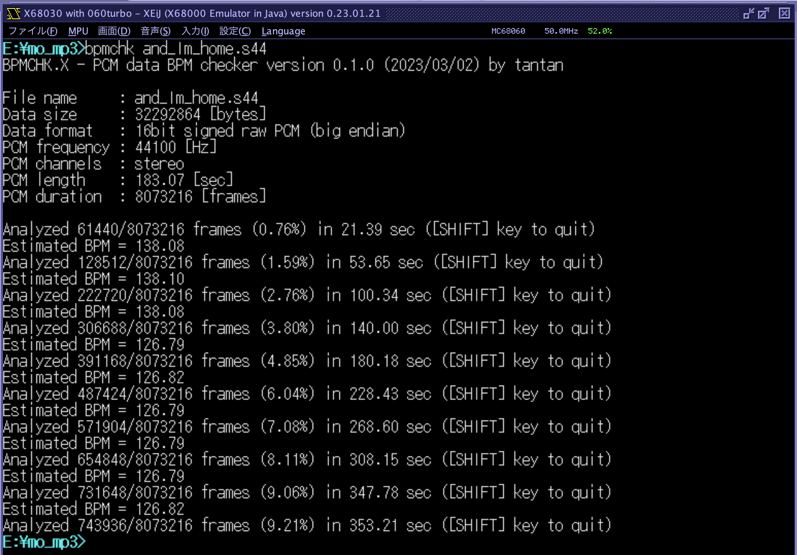

# BPMCHK.X

PCM data file BPM checker for X680x0/Human68k

S44/WAVオーディオPCMデータをaubioライブラリを使って解析し、推定BPM値を算出します。

以下の形式のPCMデータに対応しています。

- 16bit raw PCM (big endian) 32kHz/44.1kHz/48kHz stereo/mono (.S32/.S44/.S44/.M32/.M44/.M48)
- WAVE format stereo/mono (.WAV)

X68k(MSM6258V)/YM2608 ADPCM形式には対応していません。

---

### Install

BPMCKxxx.ZIP をダウンロードして展開し、BMPCHK.X をパスの通ったディレクトリに置きます。

---

### How to use

PCMデータファイル名をコマンドライン引数として指定して実行するだけです。特にオプションなどはありません。

    BPMCHK.X <pcm-file>

実行中はいつでもSHIFTキーで中断できます。定期的にその時点までの推定BPM値が出力されます。
統計処理する関係で後になるほど精度は上がりますが、値が安定してきたら打ち切って大丈夫です。

なお、当然ながら途中でテンポが変わる曲には対応できません。

時々全然実際と違うBPM値が出力されることもありますが、そういうものですw

---

### KMD歌詞データ作成のためのワークフロー

元々このプログラムは SMR.X / MP3EXP.X で使える ADPCM/PCM/MP3曲データ向け歌詞データKMDファイル作成支援を想定したものです。

推奨ワークフローは以下の通りです。

1. BPMCHK.X で推定BPM値を得る。

2. [KMDGEN.X](https://github.com/tantanGH/kmdgen) を使ってKMDテンプレートファイルを作成する。

3. SMR.X / [MP3EXP.X](https://github.com/tantanGH/mp3exp) で実際に再生しながら 2. のパラメータを微調整する。

4. KMDファイルに歌詞データを埋め込み仕上げる。

---

### License

オーディオ特性データ抽出ライブラリとして aubio 0.4.9 をx68k向けにコンパイルが通るように修正し、S44対応改造したものを利用させて頂いています。BPMCHKのライセンスはaubioのライセンスに準じGPLv3となります。

---

### Special Thanks

* KMD 技術情報およびサンプルデータ提供 thanks to かきうちさん / X68PROさん
* xdev68k thanks to ファミべのよっしんさん
* HAS060.X on run68mac thanks to YuNKさん / M.Kamadaさん / GOROmanさん
* HLK301.X on run68mac thanks to SALTさん / GOROmanさん
* XEiJ thanks to M.Kamadaさん

---

### History

* 0.1.0 (2023/03/02) ... 初版